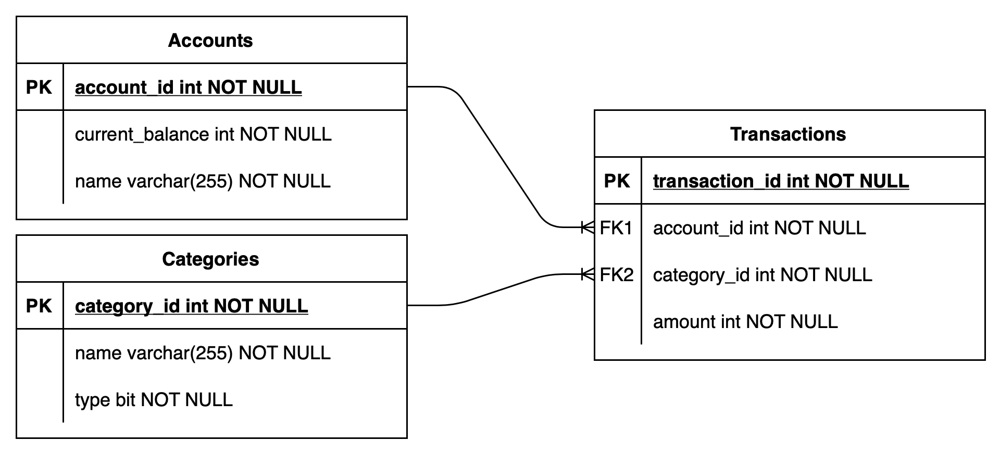

# `bdgt` architecture

## Database schema

On the picture below logical ER-diagram of `bdgt`'s database is shown.

DB consists of 3 tables:
- Accounts. This table contains information about user's bank accounts: 
  current balance and human-readable name (e.g. account number or 
  user-defined name).
- Categories. This table contains income/spending categories (e.g. 
  healthcare, food, etc.). For each category its name and type 
  (income/outcome) is stored.
- Transactions. This is the main table with all the transactions performed.
  For each transaction DB stores bank account and category references as
  long as amount of money gained or spent.
